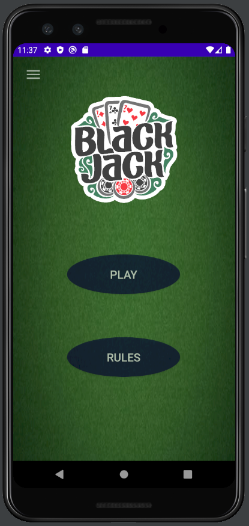
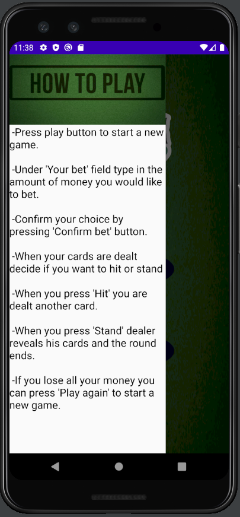
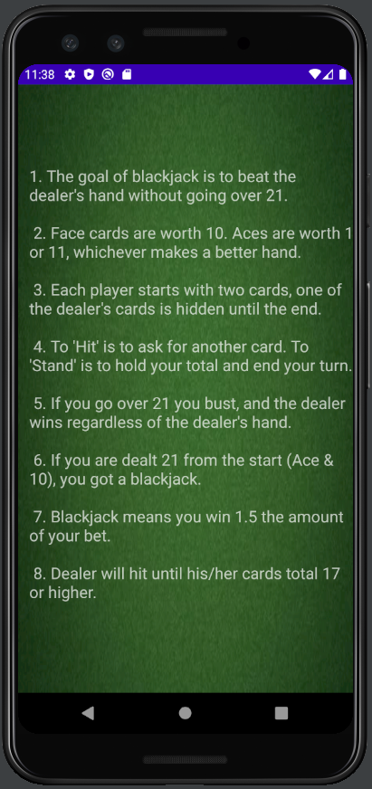
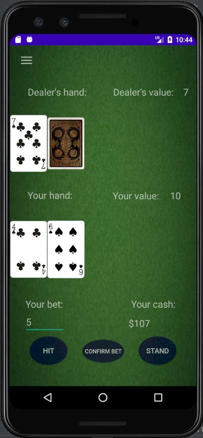
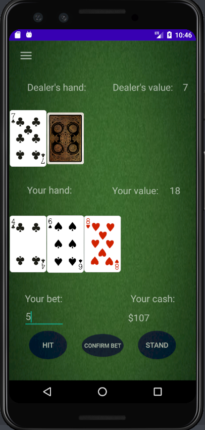
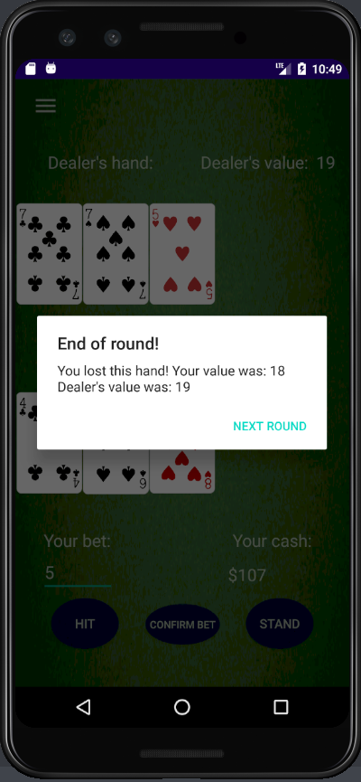
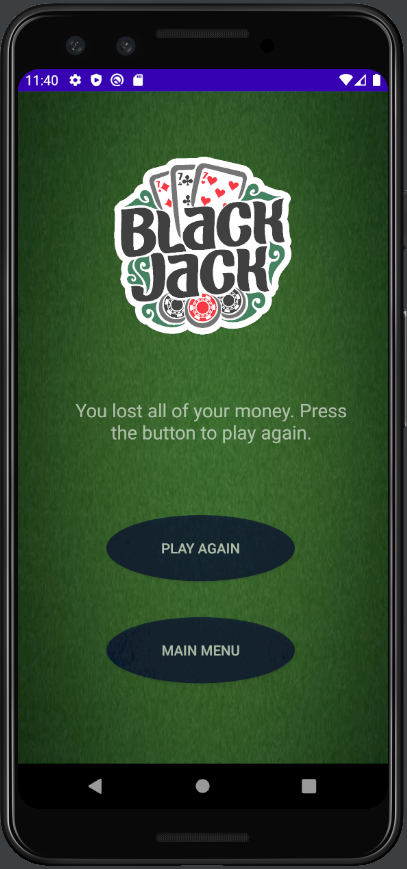

# Blackjack
Android project of a card game called "Blackjack" using Java.

## Table of contents
* [General info](#general-info)
* [Using the app](#using-the-app)
* [Status](#status)
* [Authors](#authors)

## General info

This project was developed using Android Studio. Cards and deck are implemented using classes in Java. The activities are made using constraint, linear or drawer layout. It emulates a card game called "Blackjack". It allows you to modify your bet, hit and stand. At the end of the round you are notified about the result via alert dialog. Every possible result has its own corresponding dialog which shows your hand's value and compares it to the dealer's.

## Using the app

  
From the main menu you can open new activity with game, see the rules or open sidebar.    
   
  
Instruction in sidebar tells you how to use the app.  
   
  
Activity with rules show you what\`s the goal of blackjack.  
   
  
To start round You need to type in your bet and press Confirm Bet button.  
   
  
Your cards appear on the screen with animations and you can make your decisions based on your and dealer\`s value by pressing Hit or Stand.  
   
  
When you press Hit another card is dealt to you and animated.  
   
  
When you press Stand or bust while Hitting the round ends and you\`re notified of the result by corresponding dialog popup.  
   
  
If you lose all your money you can go back to main menu or start another game.  
   

## Status
The project you can find here is in fully playable state but we wish to add more features in the foreseeable future. 

## Authors
Created by [DrelaDominika](https://github.com/DrelaDominika) and [PrzemyslawStachurski](https://github.com/PrzemyslawStachurski) - feel free to contact us!
